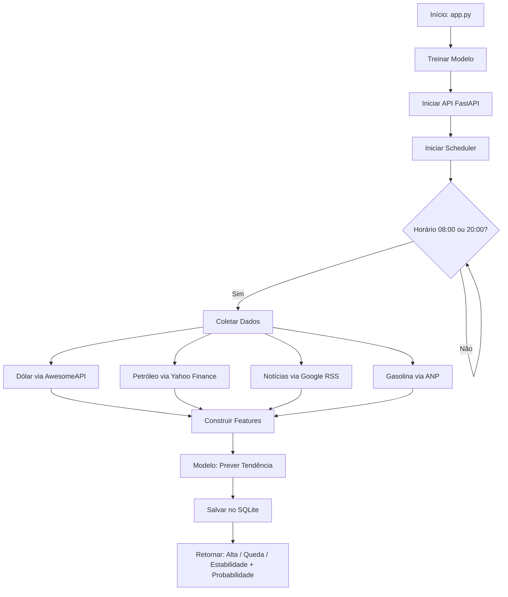
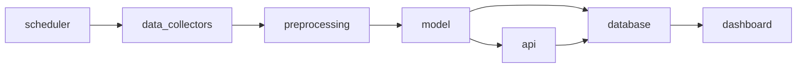

# ⛽ Gasolina IA — Previsão de Tendência do Preço da Gasolina

Sistema de previsão de **tendência** do preço da gasolina no Brasil baseado em:
- Cotação do dólar (USD/BRL)
- Preço do petróleo (Brent e WTI)
- Análise de notícias geopolíticas
- Dados históricos da ANP

> ⚠️ O sistema **não prevê o valor exato** da gasolina.  
> Ele classifica a tendência em: **Alta**, **Queda** ou **Estabilidade**.

---

## 🎯 Objetivo

Projeto acadêmico que demonstra a integração de:

- **Coleta automática de dados** de fontes públicas
- **Machine Learning** com Scikit-Learn (RandomForestClassifier)
- **API REST** com FastAPI
- **Dashboard interativo** com Streamlit
- **Automação** com APScheduler
- **Persistência** com SQLite

---

## 🚀 Instalação

### Pré-requisitos
- Python 3.10 ou superior

### Passos

```bash
# 1. Clone ou extraia o projeto
cd projeto_gasolina

# 2. Crie e ative o ambiente virtual
python -m venv venv
source venv/bin/activate        # Linux/Mac
venv\Scripts\activate           # Windows

# 3. Instale as dependências
pip install -r requirements.txt
```

---

## ▶️ Execução

### API + Scheduler (modo principal)

```bash
python app.py
```

A API estará disponível em:
- **http://localhost:8000** — API
- **http://localhost:8000/docs** — Documentação interativa (Swagger)

### Dashboard

Em um segundo terminal:

```bash
streamlit run dashboard/dashboard.py
```

O dashboard abrirá em **http://localhost:8501**

### Testes

```bash
pytest tests/ -v
```

---

## 📡 Endpoints da API

| Método | Rota        | Descrição                    |
|--------|-------------|------------------------------|
| GET    | `/saude`    | Verifica se a API está no ar |
| GET    | `/previsao` | Retorna a última previsão    |
| GET    | `/historico`| Lista as previsões salvas    |

### Exemplo de resposta `/previsao`

```json
{
  "tendencia": "Alta",
  "probabilidade": 0.78,
  "explicacao": "Tendência de ALTA com confiança de 78%. Fatores: dólar elevado (R$ 5.80), petróleo caro (US$ 92.5).",
  "data_hora": "2025-01-15T08:00:00",
  "indicadores": {
    "dolar_reais": 5.80,
    "brent_usd": 95.0,
    "wti_usd": 90.0,
    "gasolina_media": 6.60,
    "risco_noticias": 1.4
  },
  "fontes": [
    "AwesomeAPI (Dólar)",
    "Yahoo Finance (Petróleo)",
    "Google News (Notícias)",
    "ANP (Gasolina Brasil)"
  ]
}
```

---

## 🗂️ Estrutura do Projeto

```
projeto_gasolina/
│
├── app.py                        # Ponto de entrada principal
│
├── api/
│   └── routes.py                 # Endpoints FastAPI
│
├── data_collectors/
│   ├── __init__.py               # Exporta as funções de coleta
│   ├── noticias.py               # Google News RSS
│   ├── dolar.py                  # AwesomeAPI (USD/BRL)
│   ├── petroleo.py               # Yahoo Finance (Brent/WTI)
│   └── gasolina.py               # ANP (preço no Brasil)
│
├── preprocessing/
│   └── tratamento.py             # Engenharia de features
│
├── model/
│   ├── treinamento.py            # Treina o RandomForest
│   └── previsao.py               # Classe PredisorGasolina
│
├── database/
│   ├── models.py                 # Schema SQL
│   └── database.py               # Operações CRUD
│
├── scheduler/
│   └── tarefas.py                # APScheduler (08:00 e 20:00)
│
├── dashboard/
│   └── dashboard.py              # Interface Streamlit
│
├── tests/
│   ├── test_api.py               # Testes da API
│   ├── test_model.py             # Testes do modelo ML
│   └── test_database.py          # Testes do banco de dados
│
├── data/
│   └── gasolina.sqlite3          # Banco de dados (gerado automaticamente)
│
└── requirements.txt
```

---

## ⚙️ Tecnologias Utilizadas

| Tecnologia    | Uso                                      |
|---------------|------------------------------------------|
| Scikit-Learn  | Modelo RandomForestClassifier            |
| Pandas        | Manipulação de dados e features          |
| NumPy         | Geração de dados sintéticos              |
| FastAPI       | API REST                                 |
| Uvicorn       | Servidor ASGI para a API                 |
| Streamlit     | Dashboard interativo                     |
| APScheduler   | Automação de previsões (cron)            |
| SQLite        | Banco de dados local                     |
| Requests      | Coleta de dados via HTTP                 |
| Pytest        | Testes unitários                         |

---

## 🔄 Fluxo do Sistema



---

## 🏗️ Arquitetura Modular



---

## 📋 Casos de Uso

| ID  | Caso de Uso              | Ator         | Descrição                                              |
|-----|--------------------------|--------------|--------------------------------------------------------|
| UC1 | Consultar previsão atual | Usuário/API  | Acessa GET /previsao e recebe tendência + probabilidade |
| UC2 | Consultar histórico      | Usuário/API  | Acessa GET /historico e vê previsões anteriores        |
| UC3 | Gerar previsão manual    | Usuário      | Clica no botão do dashboard para forçar nova previsão  |
| UC4 | Previsão automática      | Sistema      | APScheduler executa previsão às 08:00 e 20:00          |
| UC5 | Visualizar dashboard     | Usuário      | Acessa Streamlit para ver indicadores e gráficos       |

---

## ✅ Requisitos Funcionais

| ID   | Requisito                                                                 |
|------|---------------------------------------------------------------------------|
| RF01 | O sistema deve coletar cotação do dólar via AwesomeAPI                    |
| RF02 | O sistema deve coletar preço do petróleo Brent e WTI via Yahoo Finance    |
| RF03 | O sistema deve coletar notícias geopolíticas via Google News RSS           |
| RF04 | O sistema deve coletar dados de gasolina via CSV da ANP                   |
| RF05 | O modelo deve classificar a tendência em Alta, Queda ou Estabilidade      |
| RF06 | O sistema deve retornar a probabilidade da previsão                        |
| RF07 | O sistema deve salvar cada previsão no banco SQLite                        |
| RF08 | A API deve expor endpoints /previsao e /historico                          |
| RF09 | O dashboard deve exibir a última previsão e histórico                      |
| RF10 | O scheduler deve executar previsões automáticas às 08:00 e 20:00          |

---

## 🔒 Requisitos Não Funcionais

| ID    | Requisito                                                          |
|-------|--------------------------------------------------------------------|
| RNF01 | Código comentado e legível (PEP8)                                  |
| RNF02 | Arquitetura modular com responsabilidades separadas                 |
| RNF03 | Tratamento de erros em todas as chamadas externas                  |
| RNF04 | Uso exclusivo de fontes públicas e gratuitas                       |
| RNF05 | Rastreabilidade das fontes em cada previsão                        |
| RNF06 | Testes unitários cobrindo API, modelo e banco de dados             |
| RNF07 | Valores padrão (fallback) quando APIs externas falharem            |
| RNF08 | Banco de dados não armazena histórico completo de preços           |
